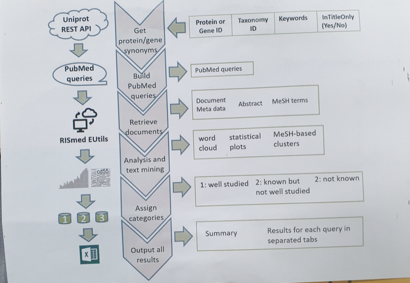

```{r setup, include = FALSE}
knitr::opts_chunk$set(
  collapse = TRUE,
  comment = "#>"
)
```

## Installation

You can install the released version of OmixLitMiner from [SIH-GIT](https://github.com/Sydney-Informatics-Hub/OmixLitMiner) with:

```{r}
#install.packages(devtools) # only if devtools is not installed
devtools::install_github("Sydney-Informatics-Hub/OmixLitMiner")
```

# About OmixLitMiner

Proteomics and genomics discovery experiments generate increasingly large result tables, necessitating more researcher time to covert data into knowledge. Literature review is an important step in this process and can be tedious for large scale experiments. An informed and strategic decision about which biomolecule targets should be pursued for follow-up experiements remains a challenge. The **OmixLitMiner** package contains functions to streamline and automate the retrieval of literature from PubMed based on Uniprot identifiers and a user defined keyword search. The algorith makes use of a ranking system as detailed below - 

The `omixLitMiner()` function takes as input argument a R Dataframe `df` as the query which looks like the example dataframe `potentialmarker` which comes with the package:

|UniProtID |IDType    | TaxID|Keyword |KeywordInTitleOnly |
|:---------|:---------|-----:|:-------|:------------------|
|Q14914    |Accession |  9606|Cancer  |Yes                |
|P0DMN0    |Accession |  9606|Cancer  |Yes                |
|P21980    |Accession |  9606|Cancer  |Yes                |
|Q61475    |Accession | 10090|Cancer  |Yes                |

It then searches the Uniprot database for synonyms, and then searches PubMed for papers containing these synonyms along with the specified keyword ('Cancer').

It returns a nested list of results from Uniprot and Pubmed.

Lastly it (optionally) generates an Excel spreadsheet that has the relevant PubMed query results, and graphs in each which show 

- publications by year
- publications by MeSH category
- a word cloud of publication titles.

**Ranking system**
The tool assigns the proteins into three main categories (1-3) and an additional Category 0. Category 1 hits are proteins/genes, which show at least one review paper where the synonyms and the selected keywords are found together in the article title, or in the abstract if that option is selected. Category 2 hits are proteins/genes where at least one publication was found, but no review article, in which the synonyms and the selected keywords are both present. Category 3 represents proteins/genes where no publication was found which mentions both the synonyms and the keywords together in the title. Category 0 is used for proteins/genes where the tool could not find any synonyms. This may happen, if the UniProt ID belongs to an isoform or to an entry that is unreviewed (i.e. TrEMBL). 

The wordclouds that are produced by the algorithm is the frequency of words in the abstracts of each search query.

# Examples
Some ways of using the OmixLitMiner package is shown below.
potentialmarker is a R dataframe that is part of the R package, for description of its contents, run the following R command
``` r
library(OmixLitMiner)
?potentialmarker
```

## Ex.1. 
Using the R data frame provided by the package, no output spreadsheet and plots specified, the object returned from omixLitMiner() is assigned to a variable.
```{r}
library(OmixLitMiner)
result <- omixLitMiner(potentialmarker)
```
The result variable has 2 list elements - 
1. summary_results - Summarizes the query results 
2. pubmed_results - Summarizes the PubMed results based on the UniProt Identifiers and key words specified by the user

## Ex.2. 
Using the R data frame provided by the package, with output spreadsheet specifed and no plots, the object returned from omixLitMiner() is not assigned to any variable.
```{r}
library(OmixLitMiner)
omixLitMiner(potentialmarker)
```

## Ex.3. 
Using the R data frame provided by the package, with output spreadsheet specifed and no plots.
```{r}
library(OmixLitMiner)
omixLitMiner(potentialmarker, output.file = "potential_marker_pubmed_results.xlsx")
```
The output spread sheet with the PubMed output will be saved in the current working directory.

## Ex.4. 
Using the R data frame provided by the package, with output spreadsheet specifed and no plots, the object returned from omixLitMiner() is not assigned to any variable.
```{r}
library(OmixLitMiner)
omixLitMiner(potentialmarker, output.file = "potential_marker_pubmed_results.xlsx", plots.dir = "plots")
```
The output spread sheet with the PubMed output will be saved in the current working directory. If an output spread sheet existed, it would be overwritten.
The images generated by the package will be saved in directory plots in the current working directory. If no plots directory was present, a new plots directory would be created.

## Ex.5. 
Reading from an Excel and converting it to a R dataframe. The potential_marker_pubmed_input.xlsx is assumed to be present at the current working directory.
```{r eval=FALSE}
library(OmixLitMiner)
library(openxlsx)
df <- readWorkbook("potential_marker_pubmed_input.xlsx")
result <- omixLitMiner(df, output.file = "input_uniprot_keywords_pubmed_results.xlsx", plots.dir = "plots")
```

## Ex.6. 
Reading an Excel, reading default Excel input that is provided by OmixLitMiner, and converting it to a R dataframe
```{r}
library(OmixLitMiner)
library(openxlsx)

# Read in input query excel file
df <- readWorkbook(system.file("extdata", "input_uniprot_keywords.xlsx", package="OmixLitMiner")) #read demo data from package
# df <- readWorkbook("path/to/my/input_query.xlsx")     # how to read an excel file on your computer
# df <- read.csv("path/to/my/input_query.csv", stringsAsFactors = F)     # how to read a csv file on your computer

# Query UniProt and PubMed and Return Results
result <- omixLitMiner(df, output.file = "input_uniprot_keywords_pubmed_results.xlsx", plots.dir = "plots")
```

# Citing
When using OmixLitMiner please cite: "Steffen P, Wu J, Hariharan S, Molloy MP, Schluter H, OmixLitMiner: A bioinformatics tool for prioritizing biological leads from omics data using literature mining."

# Figures
Thw algorithm implemented in this package to retrieve the PubMed relevant literature based on UniProt iDs and user defined keyword is depicted in the figure below.

```{r echo = FALSE, out.width = '80%'}

```


